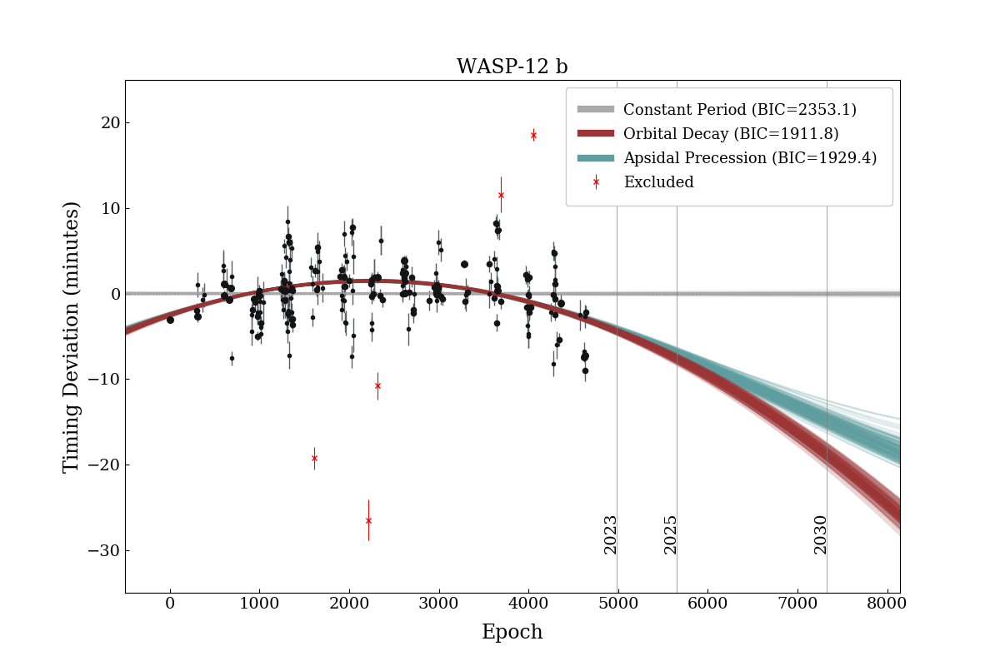

# ExoPdot

This repository contains source code, data, and a summary of results from the *"Evidence of Long-Term Period Variations in the 
Exoplanet Transit Database (ETD)"* paper by Hagey, Edwards, and Boley (2022). All data used for this paper are from the [Exoplanet Transit Database (ETD)](http://var2.astro.cz/ETD/index.php). If you are using it for your research please be sure to cite the database appropriately.

The main function of this code is to process the transit center 
times provided in the ~/DATA/ folder and compare three different transit timing models: 
(1) a planet on a constant orbital period, (2) a planet on a decaying, circular orbit, and (3) a planet that has a constant 
orbital period, but the orbit is precessing. The best-fit models are found through custom Metropolis-Hastings MCMC routines 
(with a Gibbs sampler) and compared via the Bayesian Information Criterion (BIC). As described in the paper, 
an (optional) iterative sigma-clipping algorithm is incorporated into the pipeline to handle the exclusion of spurious data points. 

### Data
Data of all 30 star-planet systems investigated in the study are available in tab-separated .txt files in the ~/DATA/ folder. 
For the top 10 targets of interest (see paper) we provide datasets that have been manually cleaned of partial 
transits and duplicate submissions. The columns contain the ETD submission number, epoch, transit center in BJD(TDB), 
uncertainty (days), data quality (DQ) factor, and source/observer.

```
#   Epoch   T_mid (BJD)    Unc. (days)  DQ  Source
1   0       2455528.86853   0.00014     1   Hellier et al. 2011
4   497     2455933.16473   0.00025     1   Starr P.
5   505     2455939.67475   0.00052     2   Naves R.
...
```

## Getting started

The code relies on the following packages that can be installed via pip: [astropy](https://github.com/astropy/astropy),
[corner](https://github.com/dfm/corner.py),
[matplotlib](https://github.com/matplotlib/matplotlib),
[numpy](https://github.com/numpy/numpy),
[scipy](https://github.com/scipy/scipy),
 and [tqdm](https://github.com/tqdm/tqdm).
 
Then clone this repository to your local machine:
```
git clone https://github.com/simonehagey/ExoPdot.git
```
Immediately upon cloning the repository and installing the required packages a simple analysis of the WASP-12 b data 
can performed by running the *main.py* script.
```
python3 main.py
```

The repository contains 7 Python scripts in addition to the transit timing data and analysis results. The functionality 
is designed to be fully encapsulated in the *main.py* script, so changes do not need to be made to other files unless 
you want to experiment with adjusting the bounds on parameters in the MCMC routines in the *fitModels.py* script.

### Settings file

Inside *main.py* you may specify the name of the "settings" .json file that define the planets, directories, and model 
fitting and plotting parameters. The default is *settings-example.json* which runs a simple WASP-12 b example. 

The first section of the file defines a list of planets to analyse (can be more than one), the directories containing the 
transit timing data and planetary system info files (see below), the data subscript (eg. change to "_ETD_og.txt" to use data pre-cleaning),
and directory where the results are to be saved. 
```
{"targets":["WASP-12"],
  "data_directory":"DATA/ETD/cleaned/",
  "data_subscript":"_ETD_clean.txt",
  "save_directory":"RESULTS/",
  "planet_directory":"SYSTEM_FILES/",
...
```
The second section of the file allows one to choose (1-yes, 0-no) whether to perform the sigma-clipping routine and/or fit the apsidal
precession model. The precession model is not chosen by default. Additionally, the desired number of 
MCMC iterations (total) and number of burn-in iterations can be defined for each model (in the order: linear, decay, precession). 
Note that for all iterations of the (optional) sigma-clipping routine, the number of MCMC iterations is hardcoded to 100,000
for efficiency, so in the settings file the user is selecting the number of iterations for the final model fit at the 
end of the routine.

```
...
  "_comment1":"settings for model fitting",
  "sigma_clip":1,
  "fit_precession":0,
  "niter":[1000000,1000000,1000000],
  "burn_in":[100000,100000,100000],
...
```

### System Info Files
All of the necessary information (and more) on the 30 star-planet systems investigated in this study are contained in separate
files in the ~/SYSTEM_FILES/ directory. For this project, only the reference transit time "tc", orbital period "p", and coordinates "RA"
and "DEC" were used. This system will be modified in future iterations to be a single file with updated orbital elements.

## Outputs

Running *main.py* automatically generates - for every planet - an O-C plot, text file displaying the printed 
model fitting and comparison results, saved copies of the MCMC posterior chains, and a "results" .json file. This
file contains the necessary outputs for interpreting the results such as the data, best-fit models, and BIC values, as
well as records from the MCMC routines such as the number of iterations, burn-in, allowed parameter ranges, and more. 
As a .json file, it is structured like a Python dictionary object, the most critical "keys" being:

* "DATA": an array (3,N) of the epochs, observations, and errors
* "MODELS": an array (3,N) of the predicted transit times from the linear, quadratic, and precession models
* "REMOVED": an array (3,N) of the epochs, observations, and errors removed during the sigma-clipping routine
* "BIC": a list of the BIC statistic for the best-fit linear, quadratic, and precession models
* "LINEAR": an array (3,2) of the best-fit linear model parameters (t0, P) with lower and upper bounds (1-sigma)
* "DECAY": an array (3,3) of the best-fit quadratic model parameters (t0, P, PdE) with lower and upper bounds (1-sigma)
* "PRECESSION": an array (3,5) of the best-fit precession model parameters (t0, P, e, w0, wdE) with lower and upper bounds (1-sigma)

See the *plots.py* script for an example of how to access and use this information if you would like to explore the results
further than the automatically generated files allow.



```
LINEAR MODEL:
t0 (transit): 2454508.978941705 + 4.644179716706276e-05 - 4.6664848923683167e-05
P0 (transit): 1.0914194874148295 + 2.0467165517956687e-08 - 2.0426244917715053e-08

DECAY MODEL:
t0 (transit): 2454508.9771983447 + 7.37910158932209e-05 - 7.39293172955513e-05
P0 (transit): 1.09142194562209 + 8.371737747481234e-08 - 8.354027358770111e-08
PdE (transit): -1.0929012268789573e-09 + 3.6291487492878124e-11 - 3.5869160037977084e-11
PdT (transit): -31.60037224439088 + 1.049339579709905 - 1.0371283162803535

PRECESSION MODEL:
t0 (transit): 2454508.970007208 + 0.001350531354546547 - 0.0007536620832979679
Ps (transit): 1.091419481302197 + 2.0326860861175078e-08 - 2.032026813481025e-08
e (transit): 0.028697329081591613 + 0.0021673374435088877 - 0.0038789680603087476
w0 (transit): 2.382071050626168 + 0.031252633718609424 - 0.05949079522495593
wdE (transit): 0.00033639079600900166 + 2.6143924199895498e-05 - 1.3306731072866345e-05

MODEL COMPARISON:
Linear model: chi^2 = 2342.4  BIC = 2353.1
Decay model: chi^2 = 1895.7  BIC = 1911.8
Precession model: chi^2 = 1902.6  BIC = 1929.4
```


Developed by [Simone Hagey](mailto:shagey@student.ubc.ca)
